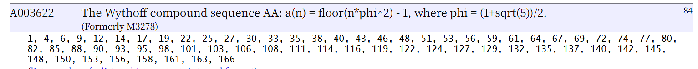

## 形式化题意
称矩阵$f$为斐波那契矩阵，即对于$\forall i \ \forall j > 2, f_{i, j} = f_{i, j - 1} + f_{i, j - 2}$
其中
$f_{1,1} = 1$, $f_{1,2} = 2$,
对于第$i$($i > 1$)的行
设$a$为前$i - 1$行中未出现的最小正整数，则$f_{i, 1} = a$, $f_{i, 2} = 2a + i - 1$
现在输入三个整数$x$,$y$,$mod$,请你求出$f_{x, y}$ 在模 $mod$ 意义下的值
$x, y \in [1, 10^9]$, $mod \in [2, 10000]$
## 思路
令$\varphi = \frac{\sqrt{5} + 1}{2}$
注意到$f_{x, 1} = \lfloor x \times \varphi ^ 2\rfloor - 1$
利用矩阵快速幂即可在$O(log(y))$的复杂度内求出答案

### 矩阵快速幂
注意到斐波那契的递推形式满足：
$$
f_n = f_{n - 1} + f_{n - 2}
$$
即每一项是由前两项通过线性运算得到的。
根据《线性代数》中的知识，矩阵乘法的实质就是对列向量进行**固定**的线性变换，将空间内的坐标映射到另一个空间（即：将所有列向量的坐标线性组合为另一个空间的坐标）。
我们不难想到用矩阵乘法来表示这个线性递推关系。因此对于斐波那契数列，递推关系可以表示为：
$$
\begin{pmatrix}
f_n \\
f_{n-1}
\end{pmatrix}=
\begin{pmatrix}
1 & 1 \\
1 & 0
\end{pmatrix}
\begin{pmatrix}
f_{n-2} \\
f_{n-1}
\end{pmatrix}
$$
则有
$$
\begin{pmatrix}
f_n \\
f_{n-1}
\end{pmatrix}=
\begin{pmatrix}
1 & 1 \\
1 & 0
\end{pmatrix}^{n - 1}
\begin{pmatrix}
f_{1} \\
f_{0}
\end{pmatrix}
$$
由于矩阵幂运算满足结合性，我们可以用**快速幂**的方式求解
### 注意到通项公式的过程
利用如下程序打印本题目要求的斐波那契数列
```py
has = set()
import sys
sys.stdout = open('output.out', 'w')
for i in range(1, 20):
    res = []
    first = 0
    for j in range(1, 114514):
        if j not in has:
            first = j
            break
    second = first * 2 - i + 1
    res += [first, second]
    while len(res) < 20:
        res.append(res[-1] + res[-2])
    has.update(res)
    print(' '.join(map(lambda x : "{:4d}".format(x), res)))

```
得到如下表
```
1    2    3    5    8    13   21   34   55   89  
4    7    11   18   29   47   76   123  199  322 
6    10   16   26   42   68   110  178  288  466 
9    15   24   39   63   102  165  267  432  699 
12   20   32   52   84   136  220  356  576  932 
14   23   37   60   97   157  254  411  665  1076
17   28   45   73   118  191  309  500  809  1309
19   31   50   81   131  212  343  555  898  1453
22   36   58   94   152  246  398  644  1042 1686
25   41   66   107  173  280  453  733  1186 1919
27   44   71   115  186  301  487  788  1275 2063
30   49   79   128  207  335  542  877  1419 2296
33   54   87   141  228  369  597  966  1563 2529
35   57   92   149  241  390  631  1021 1652 2673
38   62   100  162  262  424  686  1110 1796 2906
40   65   105  170  275  445  720  1165 1885 3050
43   70   113  183  296  479  775  1254 2029 3283
46   75   121  196  317  513  830  1343 2173 3516
48   78   126  204  330  534  864  1398 2262 3660
```
将第一列数据输入[OEIS](https://oeis.org/)
得到如下序列[A003622:The Wythoff compound sequence](https://oeis.org/A003622)

得到通项公式
